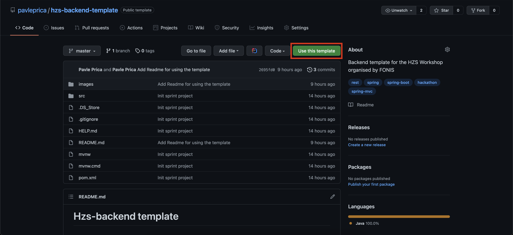
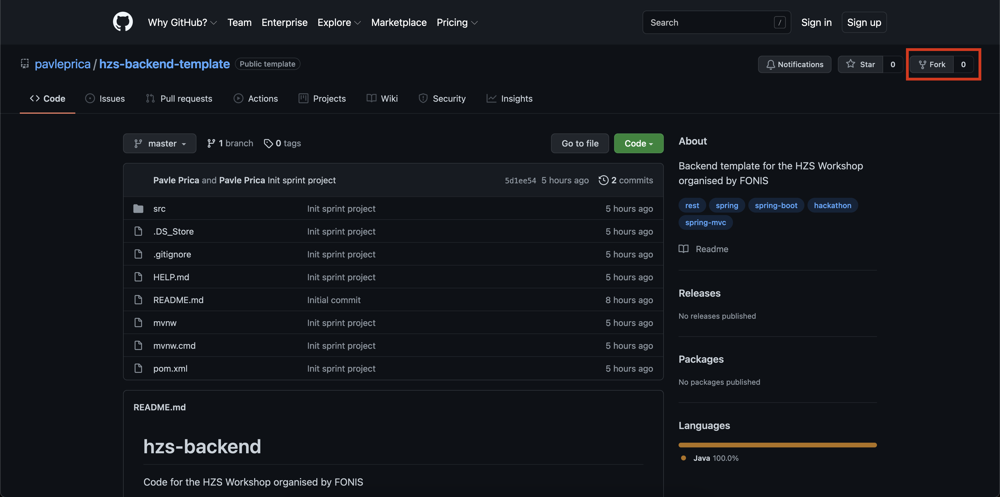
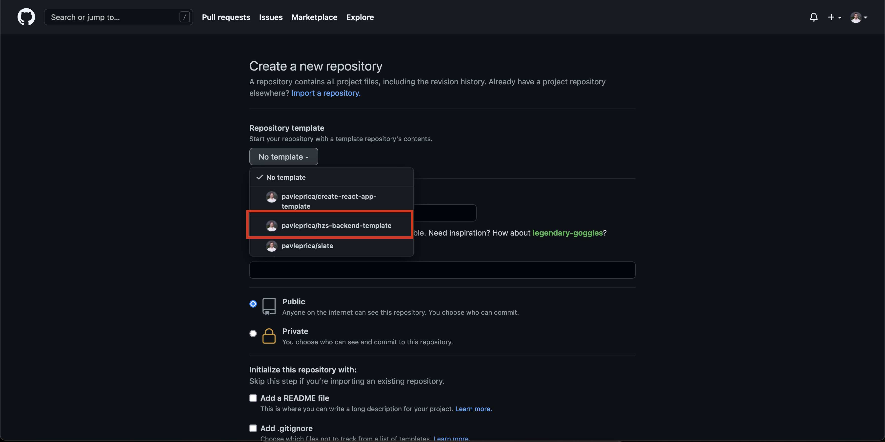

# Hzs-backend template

## About

Template Spring project made for the [HZS hackathon](https://fonis.rs/hakaton-za-srednjoskolce/)
workshop.

## How to use it

### Get the code

[Repository location](https://github.com/pavleprica/hzs-backend-template)

#### Use template

If you don't wish to fork it, easier way is to 
just click on `Use this template` button on the repository, 
and it will start the creation with this as its template.

#### Fork it

We would want to fork it if we would like to add some modifications to it. 
To do so, go to the repository and in the upper right corner there will
be the fork button.

### Create a new repository

Now we want to create the repository. When logging in and starting the create 
new repository process, select the template from the list.

### Go do some amazing work!